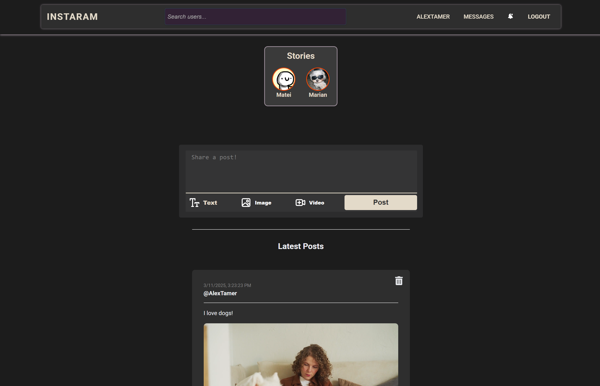
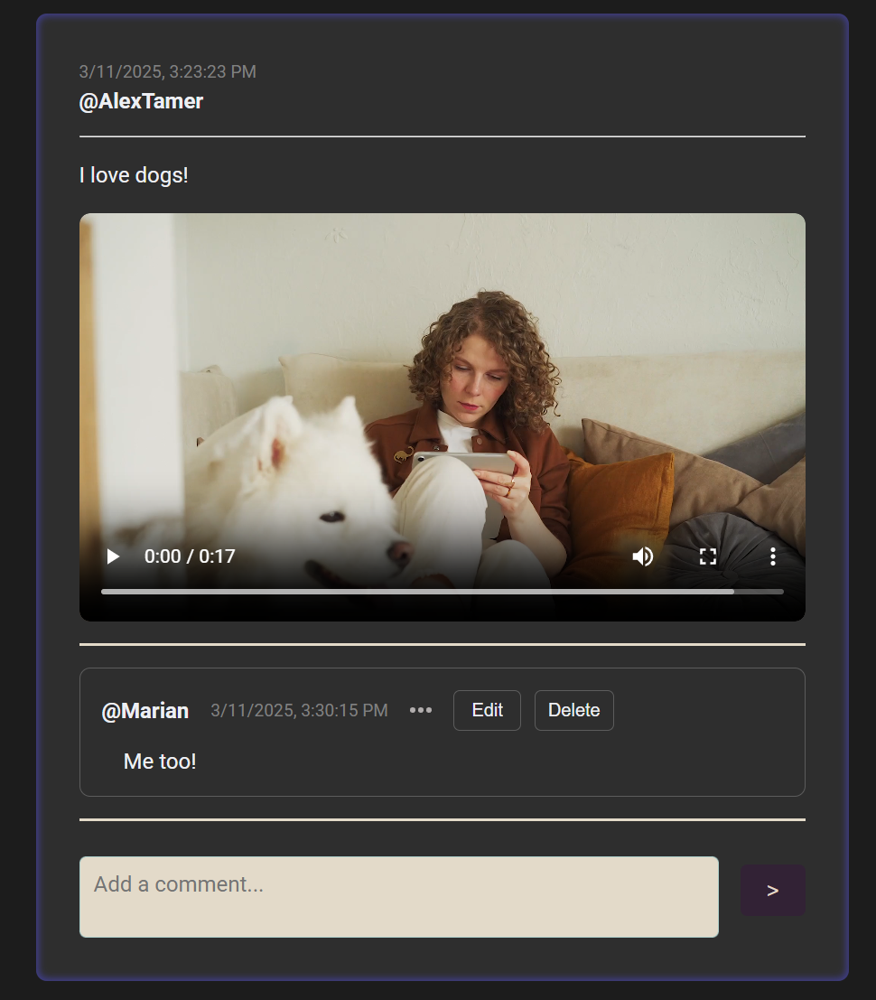
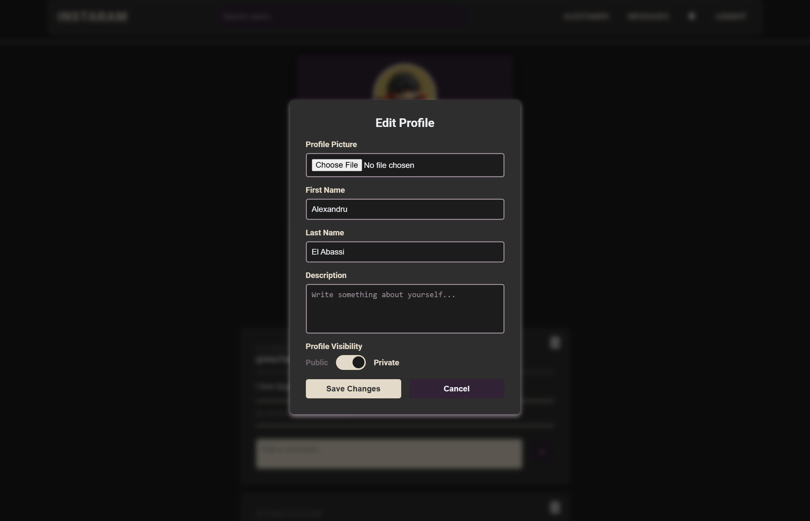
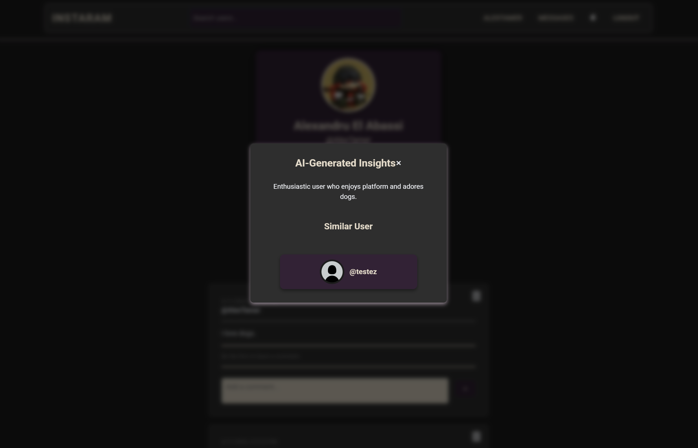
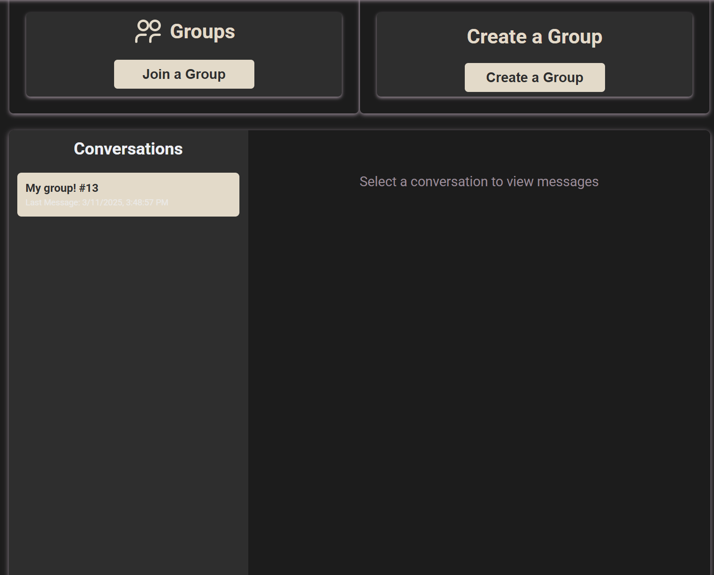
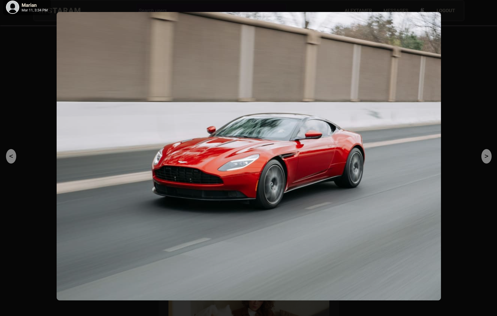

# Social Media Platform

A full-stack social media application built with **.NET, React, and PostgreSQL**, featuring posts, stories, comments, a follow system, group management, messaging, and profile customization. Integrates **OpenAI API** for AI-generated user descriptions and a recommendation system.

## Features

- User posts with create, edit, and delete functionality  
- Stories with time-limited visibility  
- Comments and follow system  
- Group management with access requests  
- Messaging system
- Profile editing 
- AI-generated user descriptions using OpenAI API  
- AI-powered recommendation system (using OpenAI API) to suggest users with similar profile interests  
- Role-based access control (RBAC) for guest, user, and admin permissions  

## Tech Stack

- **Frontend:** React, CSS  
- **Backend:** .NET, PostgreSQL, Entity Framework, JWT Authentication  
- **AI Integration:** OpenAI API  

## Screenshots & Demos

- ### **Home Feed:**  
  

- ### **Post & Comments:**  

  

- ### **Edit Profile:**  
  

  
  

- ### **AI-Generated User Descriptions & Recommandations:**  
  

  
  

  - ### **Groups:**  
  

  
  

  - ### **Follow System:**  
  

  
  

  
  - ### **Stories Feature:**  
  

  
  

